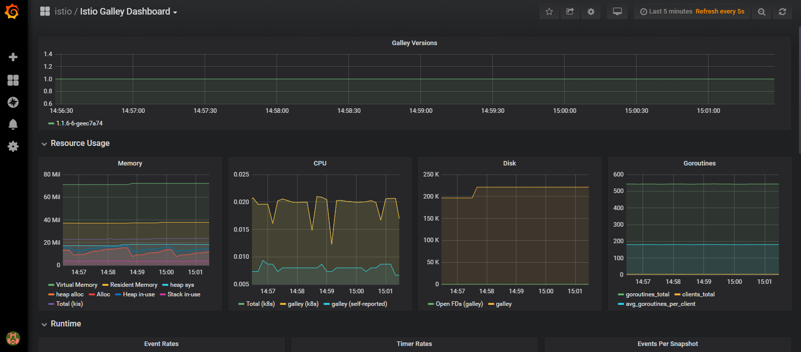
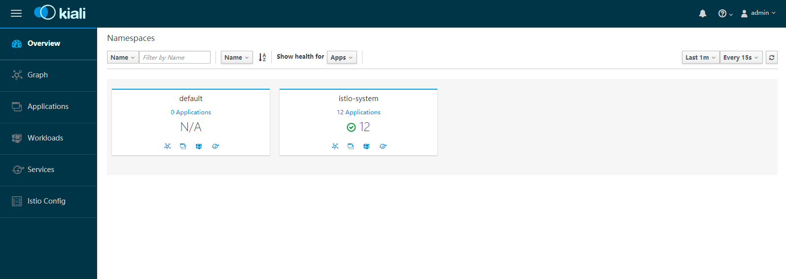

## 安装 Istio

Istio 支持多种安装方式，也有很多参数可以设置，详见[官方安装说明](https://istio.io/docs/setup/kubernetes/install/)。

这里介绍使用 Helm 部署 Istio 的基本步骤：

1. 参考 [Helm 安装说明](https://github.com/helm/helm#install)，下载、解压、安装二进制文件

    部署 tiller：

    ```sh
    $ kubectl create serviceaccount --namespace kube-system tiller
    serviceaccount/tiller created
    $ kubectl create clusterrolebinding tiller-cluster-rule --clusterrole=cluster-admin --serviceaccount=kube-system:tiller
    clusterrolebinding.rbac.authorization.k8s.io/tiller-cluster-rule created
    $ helm init --service-account tiller
    Creating /root/.helm 
    Creating /root/.helm/repository 
    Creating /root/.helm/repository/cache 
    Creating /root/.helm/repository/local 
    Creating /root/.helm/plugins 
    Creating /root/.helm/starters 
    Creating /root/.helm/cache/archive 
    Creating /root/.helm/repository/repositories.yaml 
    Adding stable repo with URL: https://kubernetes-charts.storage.googleapis.com 
    Adding local repo with URL: http://127.0.0.1:8879/charts 
    $HELM_HOME has been configured at /root/.helm.

    Tiller (the Helm server-side component) has been installed into your Kubernetes Cluster.

    Please note: by default, Tiller is deployed with an insecure 'allow unauthenticated users' policy.
    To prevent this, run `helm init` with the --tiller-tls-verify flag.
    For more information on securing your installation see: https://docs.helm.sh/using_helm/#securing-your-helm-installation
    ```

    ```sh
    $ helm version
    Client: &version.Version{SemVer:"v2.14.0", GitCommit:"05811b84a3f93603dd6c2fcfe57944dfa7ab7fd0", GitTreeState:"clean"}
    Server: &version.Version{SemVer:"v2.14.0", GitCommit:"05811b84a3f93603dd6c2fcfe57944dfa7ab7fd0", GitTreeState:"clean"}
    ```

2. 下载 Istio Release 包（1.1.7)，并安装

    ```sh
    $ wget https://github.com/istio/istio/releases/download/1.1.7/istio-1.1.7-linux.tar.gz
    $ tar zxvf istio-1.1.7-linux.tar.gz
    $ cd istio-1.1.7
    ```

    a. 安装 CRD

    ```sh
    $ helm install install/kubernetes/helm/istio-init --name istio-init --namespace istio-system
    NAME:   istio-init
    LAST DEPLOYED: Wed May 29 02:08:57 2019
    NAMESPACE: istio-system
    STATUS: DEPLOYED

    RESOURCES:
    ==> v1/ClusterRole
    NAME                     AGE
    istio-init-istio-system  0s

    ==> v1/ClusterRoleBinding
    NAME                                        AGE
    istio-init-admin-role-binding-istio-system  0s

    ==> v1/ConfigMap
    NAME          DATA  AGE
    istio-crd-10  1     0s
    istio-crd-11  1     0s

    ==> v1/Job
    NAME               COMPLETIONS  DURATION  AGE
    istio-init-crd-10  0/1          0s        0s
    istio-init-crd-11  0/1          0s        0s

    ==> v1/Pod(related)
    NAME                     READY  STATUS             RESTARTS  AGE
    istio-init-crd-10-ps8pd  0/1    ContainerCreating  0         0s
    istio-init-crd-11-f7zsm  0/1    ContainerCreating  0         0s

    ==> v1/ServiceAccount
    NAME                        SECRETS  AGE
    istio-init-service-account  1        0s

    ```

    检查 istio CRD 是否安装完成 ( 53 即为正常)

    ```sh
    $ kubectl get crds | grep 'istio.io\|certmanager.k8s.io' | wc -l
    53
    ```

    b. 安装 Istio

    Istio 默认提供了针对不同场景的安装选项 [configuration profile](https://istio.io/docs/setup/kubernetes/additional-setup/config-profiles/)

    为了方便后续的 demo 实验，我们这里选择安装 demo profile

    ```sh
    $ helm install install/kubernetes/helm/istio --name istio --namespace istio-system --values install/kubernetes/helm/istio/values-istio-demo.yaml
    NAME:   istio
    LAST DEPLOYED: Wed May 29 02:41:16 2019
    NAMESPACE: istio-system
    STATUS: DEPLOYED

    RESOURCES:
    ==> v1/ClusterRole
    NAME                                     AGE
    istio-citadel-istio-system               15s
    istio-egressgateway-istio-system         15s
    istio-galley-istio-system                15s
    istio-grafana-post-install-istio-system  15s
    istio-ingressgateway-istio-system        15s
    istio-mixer-istio-system                 15s
    istio-pilot-istio-system                 15s
    istio-reader                             15s
    istio-sidecar-injector-istio-system      15s
    kiali                                    15s
    kiali-viewer                             15s
    prometheus-istio-system                  15s

    ==> v1/ClusterRoleBinding
    NAME                                                    AGE
    istio-citadel-istio-system                              15s
    istio-egressgateway-istio-system                        15s
    istio-galley-admin-role-binding-istio-system            15s
    istio-grafana-post-install-role-binding-istio-system    15s
    istio-ingressgateway-istio-system                       15s
    istio-kiali-admin-role-binding-istio-system             15s
    istio-mixer-admin-role-binding-istio-system             15s
    istio-multi                                             15s
    istio-pilot-istio-system                                15s
    istio-sidecar-injector-admin-role-binding-istio-system  15s
    prometheus-istio-system                                 15s

    ==> v1/ConfigMap
    NAME                                                                DATA  AGE
    istio                                                               2     15s
    istio-galley-configuration                                          1     16s
    istio-grafana                                                       2     15s
    istio-grafana-configuration-dashboards-galley-dashboard             1     16s
    istio-grafana-configuration-dashboards-istio-mesh-dashboard         1     15s
    istio-grafana-configuration-dashboards-istio-performance-dashboard  1     15s
    istio-grafana-configuration-dashboards-istio-service-dashboard      1     15s
    istio-grafana-configuration-dashboards-istio-workload-dashboard     1     16s
    istio-grafana-configuration-dashboards-mixer-dashboard              1     15s
    istio-grafana-configuration-dashboards-pilot-dashboard              1     15s
    istio-grafana-custom-resources                                      2     16s
    istio-security-custom-resources                                     2     15s
    istio-sidecar-injector                                              1     15s
    kiali                                                               1     15s
    prometheus                                                          1     15s

    ==> v1/Pod(related)
    NAME                                    READY  STATUS             RESTARTS  AGE
    grafana-67c69bb567-8srps                0/1    ContainerCreating  0         15s
    istio-citadel-fc966574d-nmv4x           1/1    Running            0         15s
    istio-egressgateway-6b4cd4d9f-vkwbx     0/1    Running            0         15s
    istio-galley-cf776876f-xvxzw            0/1    ContainerCreating  0         15s
    istio-ingressgateway-59cc6ccbcb-vt544   0/1    Running            0         15s
    istio-pilot-7955cdff46-z2sp7            1/2    Running            0         15s
    istio-policy-78c7d8cffb-d9mjw           2/2    Running            0         15s
    istio-sidecar-injector-c8ddbb99c-qqlj5  0/1    Running            0         14s
    istio-telemetry-5c9cb76c56-wp6j7        2/2    Running            0         15s
    istio-tracing-5d8f57c8ff-kpgfh          0/1    ContainerCreating  0         14s
    kiali-d4d886dd7-xfnnn                   0/1    ContainerCreating  0         15s
    prometheus-d8d46c5b5-w7q9d              1/1    Running            0         15s

    ==> v1/Role
    NAME                      AGE
    istio-ingressgateway-sds  15s

    ==> v1/RoleBinding
    NAME                      AGE
    istio-ingressgateway-sds  15s

    ==> v1/Secret
    NAME   TYPE    DATA  AGE
    kiali  Opaque  2     16s

    ==> v1/Service
    NAME                    TYPE          CLUSTER-IP      EXTERNAL-IP  PORT(S)                                                                                                                                     AGE
    grafana                 ClusterIP     10.102.167.194  <none>       3000/TCP                                                                                                                                    15s
    istio-citadel           ClusterIP     10.101.217.8    <none>       8060/TCP,15014/TCP                                                                                                                          15s
    istio-egressgateway     ClusterIP     10.100.152.61   <none>       80/TCP,443/TCP,15443/TCP                                                                                                                    15s
    istio-galley            ClusterIP     10.104.204.146  <none>       443/TCP,15014/TCP,9901/TCP                                                                                                                  15s
    istio-ingressgateway    LoadBalancer  10.96.77.217    <pending>    15020:31939/TCP,80:31380/TCP,443:31390/TCP,31400:31400/TCP,15029:31405/TCP,15030:30711/TCP,15031:32652/TCP,15032:31559/TCP,15443:32151/TCP  15s
    istio-pilot             ClusterIP     10.100.173.11   <none>       15010/TCP,15011/TCP,8080/TCP,15014/TCP                                                                                                      15s
    istio-policy            ClusterIP     10.105.238.209  <none>       9091/TCP,15004/TCP,15014/TCP                                                                                                                15s
    istio-sidecar-injector  ClusterIP     10.108.182.164  <none>       443/TCP                                                                                                                                     15s
    istio-telemetry         ClusterIP     10.99.14.193    <none>       9091/TCP,15004/TCP,15014/TCP,42422/TCP                                                                                                      15s
    jaeger-agent            ClusterIP     None            <none>       5775/UDP,6831/UDP,6832/UDP                                                                                                                  15s
    jaeger-collector        ClusterIP     10.100.170.185  <none>       14267/TCP,14268/TCP                                                                                                                         15s
    jaeger-query            ClusterIP     10.97.42.224    <none>       16686/TCP                                                                                                                                   15s
    kiali                   ClusterIP     10.96.22.183    <none>       20001/TCP                                                                                                                                   15s
    prometheus              ClusterIP     10.96.89.54     <none>       9090/TCP                                                                                                                                    15s
    tracing                 ClusterIP     10.108.37.90    <none>       80/TCP                                                                                                                                      15s
    zipkin                  ClusterIP     10.108.45.185   <none>       9411/TCP                                                                                                                                    15s

    ==> v1/ServiceAccount
    NAME                                    SECRETS  AGE
    istio-citadel-service-account           1        15s
    istio-egressgateway-service-account     1        15s
    istio-galley-service-account            1        15s
    istio-grafana-post-install-account      1        15s
    istio-ingressgateway-service-account    1        15s
    istio-mixer-service-account             1        15s
    istio-multi                             1        15s
    istio-pilot-service-account             1        15s
    istio-security-post-install-account     1        15s
    istio-sidecar-injector-service-account  1        15s
    kiali-service-account                   1        15s
    prometheus                              1        15s

    ==> v1alpha2/attributemanifest
    NAME        AGE
    istioproxy  15s
    kubernetes  15s

    ==> v1alpha2/handler
    NAME           AGE
    kubernetesenv  15s
    prometheus     15s
    stdio          15s

    ==> v1alpha2/kubernetes
    NAME        AGE
    attributes  15s

    ==> v1alpha2/logentry
    NAME          AGE
    accesslog     15s
    tcpaccesslog  15s

    ==> v1alpha2/metric
    NAME                  AGE
    requestcount          15s
    requestduration       15s
    requestsize           15s
    responsesize          15s
    tcpbytereceived       15s
    tcpbytesent           15s
    tcpconnectionsclosed  15s
    tcpconnectionsopened  15s

    ==> v1alpha2/rule
    NAME                     AGE
    kubeattrgenrulerule      15s
    promhttp                 15s
    promtcp                  15s
    promtcpconnectionclosed  15s
    promtcpconnectionopen    15s
    stdio                    15s
    stdiotcp                 15s
    tcpkubeattrgenrulerule   15s

    ==> v1alpha3/DestinationRule
    NAME             AGE
    istio-policy     15s
    istio-telemetry  15s

    ==> v1beta1/ClusterRole
    NAME                                      AGE
    istio-security-post-install-istio-system  15s

    ==> v1beta1/ClusterRoleBinding
    NAME                                                   AGE
    istio-security-post-install-role-binding-istio-system  15s

    ==> v1beta1/Deployment
    NAME                    READY  UP-TO-DATE  AVAILABLE  AGE
    grafana                 0/1    1           0          15s
    istio-citadel           1/1    1           1          15s
    istio-egressgateway     0/1    1           0          15s
    istio-galley            0/1    1           0          15s
    istio-ingressgateway    0/1    1           0          15s
    istio-pilot             0/1    1           0          15s
    istio-policy            1/1    1           1          15s
    istio-sidecar-injector  0/1    1           0          15s
    istio-telemetry         1/1    1           1          15s
    istio-tracing           0/1    1           0          15s
    kiali                   0/1    1           0          15s
    prometheus              1/1    1           1          15s

    ==> v1beta1/MutatingWebhookConfiguration
    NAME                    AGE
    istio-sidecar-injector  15s

    ==> v1beta1/PodDisruptionBudget
    NAME                  MIN AVAILABLE  MAX UNAVAILABLE  ALLOWED DISRUPTIONS  AGE
    istio-egressgateway   1              N/A              0                    16s
    istio-galley          1              N/A              0                    16s
    istio-ingressgateway  1              N/A              0                    16s
    istio-pilot           1              N/A              0                    16s
    istio-policy          1              N/A              0                    16s
    istio-telemetry       1              N/A              0                    16s

    ==> v2beta1/HorizontalPodAutoscaler
    NAME                  REFERENCE                        TARGETS        MINPODS  MAXPODS  REPLICAS  AGE
    istio-egressgateway   Deployment/istio-egressgateway   <unknown>/80%  1        5        0         15s
    istio-ingressgateway  Deployment/istio-ingressgateway  <unknown>/80%  1        5        0         15s
    istio-pilot           Deployment/istio-pilot           <unknown>/80%  1        5        0         15s
    istio-policy          Deployment/istio-policy          <unknown>/80%  1        5        0         15s
    istio-telemetry       Deployment/istio-telemetry       <unknown>/80%  1        5        0         15s


    NOTES:
    Thank you for installing istio.

    Your release is named istio.

    To get started running application with Istio, execute the following steps:
    1. Label namespace that application object will be deployed to by the following command (take default namespace as an example)

    $ kubectl label namespace default istio-injection=enabled
    $ kubectl get namespace -L istio-injection

    2. Deploy your applications

    $ kubectl apply -f <your-application>.yaml

    For more information on running Istio, visit:
    https://istio.io/

    ```

3. 验证安装

    ```sh
    $ kubectl get svc -n istio-system
    NAME                     TYPE           CLUSTER-IP       EXTERNAL-IP   PORT(S)                                                                                                                                      AGE
    grafana                  ClusterIP      10.102.167.194   <none>        3000/TCP                                                                                                                                     118s
    istio-citadel            ClusterIP      10.101.217.8     <none>        8060/TCP,15014/TCP                                                                                                                           118s
    istio-egressgateway      ClusterIP      10.100.152.61    <none>        80/TCP,443/TCP,15443/TCP                                                                                                                     118s
    istio-galley             ClusterIP      10.104.204.146   <none>        443/TCP,15014/TCP,9901/TCP                                                                                                                   118s
    istio-ingressgateway     LoadBalancer   10.96.77.217     <pending>     15020:31939/TCP,80:31380/TCP,443:31390/TCP,31400:31400/TCP,15029:31405/TCP,15030:30711/TCP,15031:32652/TCP,15032:31559/TCP,15443:32151/TCP   118s
    istio-pilot              ClusterIP      10.100.173.11    <none>        15010/TCP,15011/TCP,8080/TCP,15014/TCP                                                                                                       118s
    istio-policy             ClusterIP      10.105.238.209   <none>        9091/TCP,15004/TCP,15014/TCP                                                                                                                 118s
    istio-sidecar-injector   ClusterIP      10.108.182.164   <none>        443/TCP                                                                                                                                      118s
    istio-telemetry          ClusterIP      10.99.14.193     <none>        9091/TCP,15004/TCP,15014/TCP,42422/TCP                                                                                                       118s
    jaeger-agent             ClusterIP      None             <none>        5775/UDP,6831/UDP,6832/UDP                                                                                                                   118s
    jaeger-collector         ClusterIP      10.100.170.185   <none>        14267/TCP,14268/TCP                                                                                                                          118s
    jaeger-query             ClusterIP      10.97.42.224     <none>        16686/TCP                                                                                                                                    118s
    kiali                    ClusterIP      10.96.22.183     <none>        20001/TCP                                                                                                                                    118s
    prometheus               ClusterIP      10.96.89.54      <none>        9090/TCP                                                                                                                                     118s
    tracing                  ClusterIP      10.108.37.90     <none>        80/TCP                                                                                                                                       118s
    zipkin                   ClusterIP      10.108.45.185    <none>        9411/TCP                                                                                                                                     118s

    ```

    ```sh
    $ kubectl get pods -n istio-system
    NAME                                     READY   STATUS      RESTARTS   AGE
    grafana-67c69bb567-8srps                 1/1     Running     0          2m41s
    istio-citadel-fc966574d-nmv4x            1/1     Running     0          2m41s
    istio-egressgateway-6b4cd4d9f-vkwbx      1/1     Running     0          2m41s
    istio-galley-cf776876f-xvxzw             1/1     Running     0          2m41s
    istio-ingressgateway-59cc6ccbcb-vt544    1/1     Running     0          2m41s
    istio-init-crd-10-7nj6p                  0/1     Completed   0          19m
    istio-init-crd-11-rcq6b                  0/1     Completed   0          19m
    istio-pilot-7955cdff46-z2sp7             2/2     Running     0          2m41s
    istio-policy-78c7d8cffb-d9mjw            2/2     Running     2          2m41s
    istio-sidecar-injector-c8ddbb99c-qqlj5   1/1     Running     0          2m40s
    istio-telemetry-5c9cb76c56-wp6j7         2/2     Running     2          2m41s
    istio-tracing-5d8f57c8ff-kpgfh           1/1     Running     0          2m40s
    kiali-d4d886dd7-xfnnn                    1/1     Running     0          2m41s
    prometheus-d8d46c5b5-w7q9d               1/1     Running     0          2m41s
    ```

    ##### 访问 grafana （admin/admin）

    ```sh
    $ kubectl port-forward --address 0.0.0.0 pod/grafana-67c69bb567-8srps -n istio-system 3000:3000
    ```

    浏览器访问 http://\<IP>:3000，其中 \<IP> 为执行上述命令的主机 IP

    选择 Galley Dashboard，你会看到类似如下的内容

    

    ##### 访问 kiali （admin/admin）

    注意这里需要预先配置下 kiali 的 ConfigMap（可能是这个版本的缺陷）

    ```sh
    $ kubectl edit cm kiali -n istio-system
    ```

    配置上 grafana 的地址：

    ```yaml
    external_services:
        grafana:
            url: http://grafana.istio-system:3000
    ```

    然后重启 kiali Pod，再开启端口转发

    ```sh
    $ kubectl port-forward --address 0.0.0.0 pod/kiali-d4d886dd7-mrzt8 -n istio-system 20001:20001
    ```

    浏览器访问 http://\<IP>:20001/kiali，其中 \<IP> 为执行上述命令的主机 IP

    你会看到类似如下的内容

    