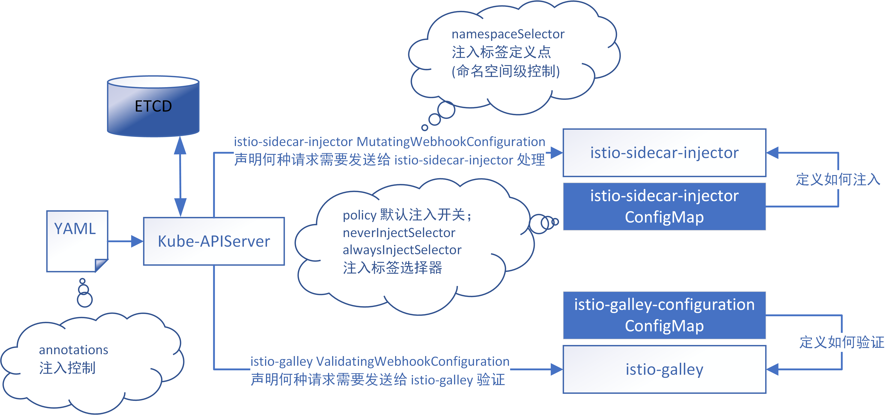

## Sidecar 注入

Istio sidecar 注入支持手动和自动两种方式，手动注入会直接修改你的 yaml 配置，自动注入则会在 Pod 的生成过程中动态注入，不会更改 yaml 文件。

这两种注入方式都会从 `istio-system` 命名空间的 `istio-sidecar-injector` 和 `istio` 这两个 ConfigMap 中获取配置信息。其中，手动方式亦可通过 `--injectConfigFile`、`--meshConfigFile` 自己指定要使用的注入配置。

```sh
$ kubectl get cm -n istio-system
NAME                                                                 DATA   AGE
istio                                                                2      24h
istio-crd-10                                                         1      24h
istio-crd-11                                                         1      24h
istio-galley-configuration                                           1      24h
istio-grafana                                                        2      24h
istio-grafana-configuration-dashboards-galley-dashboard              1      24h
istio-grafana-configuration-dashboards-istio-mesh-dashboard          1      24h
istio-grafana-configuration-dashboards-istio-performance-dashboard   1      24h
istio-grafana-configuration-dashboards-istio-service-dashboard       1      24h
istio-grafana-configuration-dashboards-istio-workload-dashboard      1      24h
istio-grafana-configuration-dashboards-mixer-dashboard               1      24h
istio-grafana-configuration-dashboards-pilot-dashboard               1      24h
istio-grafana-custom-resources                                       2      24h
istio-security                                                       1      24h
istio-security-custom-resources                                      2      24h
istio-sidecar-injector                                               1      24h
kiali                                                                1      24h
prometheus                                                           1      24h
```

### 手动注入

手动注入依赖 `istioctl` 命令行工具完成。

`istioctl` 位于 `istio-1.1.7/bin` 文件夹下，直接就可以使用。

实例演示：

samples/sleep/sleep.yaml

```yaml
# Copyright 2017 Istio Authors
#
#   Licensed under the Apache License, Version 2.0 (the "License");
#   you may not use this file except in compliance with the License.
#   You may obtain a copy of the License at
#
#       http://www.apache.org/licenses/LICENSE-2.0
#
#   Unless required by applicable law or agreed to in writing, software
#   distributed under the License is distributed on an "AS IS" BASIS,
#   WITHOUT WARRANTIES OR CONDITIONS OF ANY KIND, either express or implied.
#   See the License for the specific language governing permissions and
#   limitations under the License.

##################################################################################################
# Sleep service
##################################################################################################
apiVersion: v1
kind: ServiceAccount
metadata:
  name: sleep
---
apiVersion: v1
kind: Service
metadata:
  name: sleep
  labels:
    app: sleep
spec:
  ports:
  - port: 80
    name: http
  selector:
    app: sleep
---
apiVersion: extensions/v1beta1
kind: Deployment
metadata:
  name: sleep
spec:
  replicas: 1
  template:
    metadata:
      labels:
        app: sleep
    spec:
      serviceAccountName: sleep
      containers:
      - name: sleep
        image: pstauffer/curl
        command: ["/bin/sleep", "3650d"]
        imagePullPolicy: IfNotPresent
---
```

```sh
$ istioctl kube-inject -f samples/sleep/sleep.yaml | kubectl apply -f -
serviceaccount/sleep created
service/sleep created
deployment.extensions/sleep created
$ kubectl get pod
NAME                    READY   STATUS    RESTARTS   AGE
sleep-5c5dcdf46-sz9sj   2/2     Running   0          43s
```

可以看到 `sleep` 应用的 Pod 内容器数量为 2 。

查看 `sleep` Pod 详情信息：

```sh
$ kubectl describe pod $(kubectl get pod -l app=sleep -o jsonpath='{.items[0].metadata.name}')
Name:               sleep-5c5dcdf46-sz9sj
Namespace:          default
Priority:           0
PriorityClassName:  <none>
Node:               node-vtdo-bocloud/192.168.137.193
Start Time:         Thu, 30 May 2019 02:50:07 -0400
Labels:             app=sleep
                    pod-template-hash=5c5dcdf46
Annotations:        cni.projectcalico.org/podIP: 192.200.126.25/32
                    sidecar.istio.io/status:
                      {"version":"f5ccf91fad7f2d056f204a075aff1128670ca6997fecdeccaf7a2af6a498558c","initContainers":["istio-init"],"containers":["istio-proxy"]...
Status:             Running
IP:                 192.200.126.25
Controlled By:      ReplicaSet/sleep-5c5dcdf46
Init Containers:
  istio-init:
    Container ID:  docker://35d35d326e0d59577bd8df99633a7ca22a07bd50ac1cff051a68487b6531cc64
    Image:         docker.io/istio/proxy_init:1.1.7
    Image ID:      docker-pullable://istio/proxy_init@sha256:9056ebb0757be99006ad568331e11bee99ae0daaa4459e7c15dfaf0e0cba2f48
    Port:          <none>
    Host Port:     <none>
    Args:
      -p
      15001
      -u
      1337
      -m
      REDIRECT
      -i
      *
      -x
      
      -b
      
      -d
      15020
    State:          Terminated
      Reason:       Completed
      Exit Code:    0
      Started:      Thu, 30 May 2019 02:50:20 -0400
      Finished:     Thu, 30 May 2019 02:50:20 -0400
    Ready:          True
    Restart Count:  0
    Limits:
      cpu:     100m
      memory:  50Mi
    Requests:
      cpu:        10m
      memory:     10Mi
    Environment:  <none>
    Mounts:
      /var/run/secrets/kubernetes.io/serviceaccount from sleep-token-tb6vz (ro)
Containers:
  sleep:
    Container ID:  docker://e5be202a17d8f508c26abb836533918a114ac165d4b517aaa8b0cac5d9e197bf
    Image:         pstauffer/curl
    Image ID:      docker-pullable://pstauffer/curl@sha256:2663156457abb72d269eb19fe53c2d49e2e4a9fdcb9fa8f082d0282d82eb8e42
    Port:          <none>
    Host Port:     <none>
    Command:
      /bin/sleep
      3650d
    State:          Running
      Started:      Thu, 30 May 2019 02:50:32 -0400
    Ready:          True
    Restart Count:  0
    Environment:    <none>
    Mounts:
      /var/run/secrets/kubernetes.io/serviceaccount from sleep-token-tb6vz (ro)
  istio-proxy:
    Container ID:  docker://009046f5ac784ed39344c556da2f5162886fd29a2c00dd013ff6b57b218927ad
    Image:         docker.io/istio/proxyv2:1.1.7
    Image ID:      docker-pullable://istio/proxyv2@sha256:e6f039115c7d5ef9c8f6b049866fbf9b6f5e2255d3a733bb8756b36927749822
    Port:          15090/TCP
    Host Port:     0/TCP
    Args:
      proxy
      sidecar
      --domain
      $(POD_NAMESPACE).svc.cluster.local
      --configPath
      /etc/istio/proxy
      --binaryPath
      /usr/local/bin/envoy
      --serviceCluster
      sleep.$(POD_NAMESPACE)
      --drainDuration
      45s
      --parentShutdownDuration
      1m0s
      --discoveryAddress
      istio-pilot.istio-system:15010
      --zipkinAddress
      zipkin.istio-system:9411
      --connectTimeout
      10s
      --proxyAdminPort
      15000
      --concurrency
      2
      --controlPlaneAuthPolicy
      NONE
      --statusPort
      15020
      --applicationPorts
      
    State:          Running
      Started:      Thu, 30 May 2019 02:50:32 -0400
    Ready:          True
    Restart Count:  0
    Limits:
      cpu:     2
      memory:  1Gi
    Requests:
      cpu:      100m
      memory:   128Mi
    Readiness:  http-get http://:15020/healthz/ready delay=1s timeout=1s period=2s #success=1 #failure=30
    Environment:
      POD_NAME:                      sleep-5c5dcdf46-sz9sj (v1:metadata.name)
      POD_NAMESPACE:                 default (v1:metadata.namespace)
      INSTANCE_IP:                    (v1:status.podIP)
      ISTIO_META_POD_NAME:           sleep-5c5dcdf46-sz9sj (v1:metadata.name)
      ISTIO_META_CONFIG_NAMESPACE:   default (v1:metadata.namespace)
      ISTIO_META_INTERCEPTION_MODE:  REDIRECT
      ISTIO_METAJSON_LABELS:         {"app":"sleep"}
                                     
    Mounts:
      /etc/certs/ from istio-certs (ro)
      /etc/istio/proxy from istio-envoy (rw)
      /var/run/secrets/kubernetes.io/serviceaccount from sleep-token-tb6vz (ro)
Conditions:
  Type              Status
  Initialized       True 
  Ready             True 
  ContainersReady   True 
  PodScheduled      True 
Volumes:
  istio-envoy:
    Type:       EmptyDir (a temporary directory that shares a pod's lifetime)
    Medium:     Memory
    SizeLimit:  <unset>
  istio-certs:
    Type:        Secret (a volume populated by a Secret)
    SecretName:  istio.sleep
    Optional:    true
  sleep-token-tb6vz:
    Type:        Secret (a volume populated by a Secret)
    SecretName:  sleep-token-tb6vz
    Optional:    false
QoS Class:       Burstable
Node-Selectors:  <none>
Tolerations:     node.kubernetes.io/not-ready:NoExecute for 300s
                 node.kubernetes.io/unreachable:NoExecute for 300s
Events:
  Type    Reason     Age    From                        Message
  ----    ------     ----   ----                        -------
  Normal  Scheduled  7m27s  default-scheduler           Successfully assigned default/sleep-5c5dcdf46-sz9sj to node-vtdo-bocloud
  Normal  Pulling    7m26s  kubelet, node-vtdo-bocloud  Pulling image "docker.io/istio/proxy_init:1.1.7"
  Normal  Pulled     7m15s  kubelet, node-vtdo-bocloud  Successfully pulled image "docker.io/istio/proxy_init:1.1.7"
  Normal  Created    7m14s  kubelet, node-vtdo-bocloud  Created container istio-init
  Normal  Started    7m14s  kubelet, node-vtdo-bocloud  Started container istio-init
  Normal  Pulling    7m14s  kubelet, node-vtdo-bocloud  Pulling image "pstauffer/curl"
  Normal  Pulled     7m2s   kubelet, node-vtdo-bocloud  Successfully pulled image "pstauffer/curl"
  Normal  Created    7m2s   kubelet, node-vtdo-bocloud  Created container sleep
  Normal  Started    7m2s   kubelet, node-vtdo-bocloud  Started container sleep
  Normal  Pulled     7m2s   kubelet, node-vtdo-bocloud  Container image "docker.io/istio/proxyv2:1.1.7" already present on machine
  Normal  Created    7m2s   kubelet, node-vtdo-bocloud  Created container istio-proxy
  Normal  Started    7m1s   kubelet, node-vtdo-bocloud  Started container istio-proxy
```

可以看到运行中的容器除了 `sleep`，还有 `istio-proxy` sidecar。

### 自动注入

自动注入依赖 kube-apiserver 的准入控制功能，因此我们需要预先保证 kube-apiserver 的启动参数包含了必需的准入控制器选项。

通过以下命令查看准入选项：

```sh
$ kubectl api-versions | grep admissionregistration
admissionregistration.k8s.io/v1beta1
```

以上输出，证明准入控制选项已经支持自动注入了。

sidecar 的自动注入默认被开启，你可以通过设置 `sidecarInjectorWebhook.enabled=false` 将其关闭。

实例演示：

首先，清理掉我们通过手动注入方式创建的 `sleep` 应用

```sh
$ kubectl delete -f samples/sleep/sleep.yaml
serviceaccount "sleep" deleted
service "sleep" deleted
deployment.extensions "sleep" deleted
```

然后，重新创建 `sleep` 应用

```sh
$ kubectl apply -f samples/sleep/sleep.yaml
serviceaccount/sleep created
service/sleep created
deployment.extensions/sleep created
$ kubectl get deployment -o wide
NAME    READY   UP-TO-DATE   AVAILABLE   AGE   CONTAINERS   IMAGES           SELECTOR
sleep   1/1     1            1           64s   sleep        pstauffer/curl   app=sleep
$ kubectl get pod -l app=sleep
NAME                     READY   STATUS    RESTARTS   AGE
sleep-5fb55468cb-rqxwk   1/1     Running   0          28s
```

目前来看，`1/1` 显示没有 sidecar 注入。

下边重点来了，我们开启 `default` 命名空间的自动注入功能

```sh
$ kubectl label namespace default istio-injection=enabled
namespace/default labeled
$ kubectl get namespace -L istio-injection
NAME              STATUS   AGE   ISTIO-INJECTION
default           Active   26h   enabled
istio-system      Active   25h   
kube-node-lease   Active   26h   
kube-public       Active   26h   
kube-system       Active   26h   
```

再看下，`sleep` 应用：

```sh
$ kubectl get pod -l app=sleep
NAME                     READY   STATUS    RESTARTS   AGE
sleep-5fb55468cb-rqxwk   1/1     Running   0          85s
```

仍然是 `1/1`，并没有直接启动起来 sidecar 容器。

为什么呢？ 因为这种基于准入控制注入的模式，只有在容器创建的时候才能拦截请求进而注入，
`sleep` 容器在不进行二次创建的情况下，是不会自动注入的。

下面我们删掉 `sleep` Pod，让它自动重建

```sh
$ kubectl delete pod -l app=sleep
pod "sleep-5fb55468cb-rqxwk" deleted
$ kubectl get pod -l app=sleep
NAME                     READY   STATUS    RESTARTS   AGE
sleep-5fb55468cb-28c9p   2/2     Running   0          58s
```

可以看到，`2/2` 注入完成了。

### 原理分析

自动注入，主要是借助了 `admissionregistration.k8s.io/v1beta1` 提供的 `MutatingAdmissionWebhook` 和 `ValidatingAdmissionWebhook` 这两个准入控制功能实现的。

```sh
$ kubectl get mutatingwebhookconfiguration
NAME                     CREATED AT
istio-sidecar-injector   2019-05-29T06:41:17Z
$ kubectl get validatingwebhookconfigurations
NAME           CREATED AT
istio-galley   2019-05-29T06:41:40Z
```

`MutatingAdmissionWebhook` 的核心配置毫无例外也是 Kubernetes 管理的一种对象，可以手动修改。

例如，你可以通过修改该配置实现默认在所有命名空间自动注入（修改配置项中的 namespaceSelector 即可）。

```sh
$ kubectl edit mutatingwebhookconfiguration istio-sidecar-injector
# Please edit the object below. Lines beginning with a '#' will be ignored,
# and an empty file will abort the edit. If an error occurs while saving this file will be
# reopened with the relevant failures.
#
apiVersion: admissionregistration.k8s.io/v1beta1
kind: MutatingWebhookConfiguration
metadata:
  creationTimestamp: "2019-05-29T06:41:17Z"
  generation: 2
  labels:
    app: sidecarInjectorWebhook
    chart: sidecarInjectorWebhook
    heritage: Tiller
    release: istio
  name: istio-sidecar-injector
  resourceVersion: "15505"
  selfLink: /apis/admissionregistration.k8s.io/v1beta1/mutatingwebhookconfigurations/istio-sidecar-injector
  uid: c2f56ba3-81dc-11e9-b133-000c29eb48e3
webhooks:
- admissionReviewVersions:
  - v1beta1
  clientConfig:
    caBundle: LS0tLS1CRUdJTiBDRVJUSUZJQ0FURS0tLS0tCk1JSUMzakNDQWNhZ0F3SUJBZ0lSQUloOXdwRjdjbnk4SC9NS294S0J1cVF3RFFZSktvWklodmNOQVFFTEJRQXcKR0RFV01CUUdBMVVFQ2hNTlkyeDFjM1JsY2k1c2IyTmhiREFlRncweE9UQTFNamt3TmpJMU1qRmFGdzB5TURBMQpNamd3TmpJMU1qRmFNQmd4RmpBVUJnTlZCQW9URFdOc2RYTjBaWEl1Ykc5allXd3dnZ0VpTUEwR0NTcUdTSWIzCkRRRUJBUVVBQTRJQkR3QXdnZ0VLQW9JQkFRQ3dXYitrRGE0ZkdqVzJzZlhrTEhiK2UvM1Z0cDA1VlJPTklhaE4Kd01oTzJCNnRzRU1pMlJ6c2ljc015YWRiK2lhOG5tSmw1THhXTi81cTVCYnF2WVlvclNhOUZHZ21RTkFPOURrNApNdksvOHJZMnZScGptdCsrS1o0cW9lWUJsNHRhWHhQS2t0ODhLSWxqeklXL3J4cEwzNWk4dzlrMEl4UThVdFRNCkZlLzFGWDVuQmxyZTNRQnJVNTdyb2pRU2ZJRkh2N2hMNjdMN2krU0I4blNacWM1UjhsUkhBVkdOUmk2aGJObmwKSG83VkJHWUVFdS9yMWZPd3dMdE1OR3BVYk1XNlg4M1B3OHpaY3ZtWHBXSi9KUldjbGVhYzJod2d0cGRmWUlzZgoySXJxczRKKzExZUdLU25IZXA2a2FiNVRoQjd1N1R2eElZOWNPVlNoQnRkMzZ4S1pBZ01CQUFHakl6QWhNQTRHCkExVWREd0VCL3dRRUF3SUNCREFQQmdOVkhSTUJBZjhFQlRBREFRSC9NQTBHQ1NxR1NJYjNEUUVCQ3dVQUE0SUIKQVFDbFQySzE2QVZTRkd5OCsycGw1Nk4zUW5qc1dyMSt3KzdhRTh2Q2hzem5sdFVBajNBa1c4OTBaaVJDdU9FZQo2Q2VzNW0wK1FoeWxQQXhUSHlob0ZsTmlOM2I3aHZwWmFOWGlueWszcjE0cG5XNzd3bXZ0a3Y1TlJOeUpXeXNSClBUdFk4OVI0cENpZXhwQ1pmS1dIdDVVTlpSMzE3ZG12RW43WFluT1lHdlFsWU1NMFNpdjVHVWczeUxteXBqUmsKbUMxcmZpZk5rRmdVeTRwMFpqZXFycU5QbHhjS1RNUmk1VmtEUGdPZm11RVFFa3pjMjhWL3hvNlFEMU1OOHJKRQpEN0FNbUN6MTBBaGkybndTN1E0OWlHeVozeEVLS0IrTUJhVlh4THRMOXFENkwxOXZ3alVQMUlzdXh0bExqTkl5ClErZXhSd3FJeDQvZE1JY2dzdVBsdU9ZUQotLS0tLUVORCBDRVJUSUZJQ0FURS0tLS0tCg==
    service:
      name: istio-sidecar-injector
      namespace: istio-system
      path: /inject
  failurePolicy: Fail
  name: sidecar-injector.istio.io
  namespaceSelector:
    matchLabels:
      istio-injection: enabled
  rules:
  - apiGroups:
    - ""
    apiVersions:
    - v1
    operations:
    - CREATE
    resources:
    - pods
    scope: '*'
  sideEffects: Unknown
  timeoutSeconds: 30
```

#### 额外控制

除了命名空间级的自动注入控制，还可以通过 annotations 控制单个应用是否注入 sidecar。

实例演示：

```sh
$ kubectl delete -f samples/sleep/sleep.yaml
serviceaccount "sleep" deleted
service "sleep" deleted
deployment.extensions "sleep" deleted
```

修改 `sleep.yaml` ：

```yaml
apiVersion: v1
kind: ServiceAccount
metadata:
  name: sleep
---
apiVersion: v1
kind: Service
metadata:
  name: sleep
  labels:
    app: sleep
spec:
  ports:
  - port: 80
    name: http
  selector:
    app: sleep
---
apiVersion: extensions/v1beta1
kind: Deployment
metadata:
  name: sleep
spec:
  replicas: 1
  template:
    metadata:
      annotations:
        sidecar.istio.io/inject: "false"
      labels:
        app: sleep
    spec:
      serviceAccountName: sleep
      containers:
      - name: sleep
        image: pstauffer/curl
        command: ["/bin/sleep", "3650d"]
        imagePullPolicy: IfNotPresent
---
```

变更之处在于，Deployment 的 Pod template 添加了 annotations: `sidecar.istio.io/inject: "false"`。

使用该文件创建 `sleep` 应用：

```sh
$ kubectl apply -f samples/sleep/sleep-with-annotations.yaml
serviceaccount/sleep created
service/sleep created
deployment.extensions/sleep created
$ kubectl get pod -l app=sleep
NAME                     READY   STATUS    RESTARTS   AGE
sleep-6d4c655fd9-jp225   1/1     Running   0          82s
```

可以看到，通过 annotations 注解，屏蔽了来自 namespace 级别的注入规则，并没有在 `sleep` 中注入 sidecar。

此外，还可以通过修改 `istio-sidecar-injector` ConfigMap 的 `neverInjectSelector` 配置项，设定具备哪些 Label 的应用不执行注入，相反地，也有 `alwaysInjectSelector` 配置项，用于设定具备哪些 Label 的应用总是注入。注意，Label 之间是**或**的关系，只要有一个匹配上了就会直接返回，不再继续匹配。

```yaml
apiVersion: v1
kind: ConfigMap
metadata:
  name: istio-sidecar-injector
data:
  config: |-
    policy: enabled
    neverInjectSelector:
      - matchExpressions:
        - {key: openshift.io/build.name, operator: Exists}
      - matchExpressions:
        - {key: openshift.io/deployer-pod-for.name, operator: Exists}
    template: |-
      initContainers:
```

#### 卸载自动注入功能

```sh
$ kubectl delete mutatingwebhookconfiguration istio-sidecar-injector
$ kubectl -n istio-system delete service istio-sidecar-injector
$ kubectl -n istio-system delete deployment istio-sidecar-injector
$ kubectl -n istio-system delete serviceaccount istio-sidecar-injector-service-account
$ kubectl delete clusterrole istio-sidecar-injector-istio-system
$ kubectl delete clusterrolebinding istio-sidecar-injector-admin-role-binding-istio-system
```

#### 总结

整体来看，自动注入的流程如下：



1. 首先，通过 `MutatingAdmissionWebhook` 定义哪些请求要通过 `istio-sidecar-injector`；
2. 然后，`istio-sidecar-injector` 通过读取 `istio-sidecar-injector` ConfigMap 判断如何注入；

注入规则：

1. 通过 `istio-sidecar-injector` ConfigMap 的 `policy` 定义默认是注入还是不注入；
2. 优先级 `Pod Annotations → NeverInjectSelector → AlwaysInjectSelector → Default Policy`；
3. `MutatingAdmissionWebhook` 控制 namespace 是否走自动注入流程；

好奇的想法：

1. 已经手动注入过的 Yaml，会不会又走一遍自动注入，重复注入？
   
   答：实验了不会，大概 Pod 里限制只能有一个 `istio-proxy` 容器吧。
2. 对同一个文件重复执行两遍手动注入，会不会重复注入？
   
   答：会，而且这个 Yaml 会因为容器等重名产生问题，最好提前备份好原 Yaml。