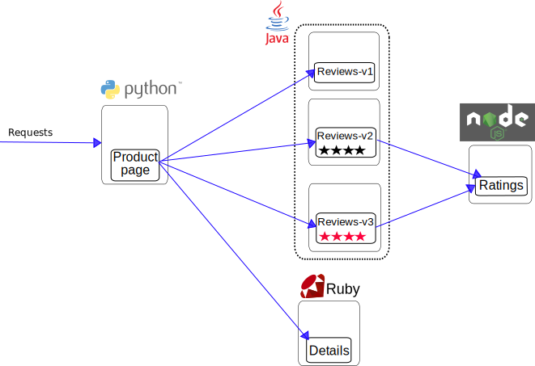

## 路由控制

本文演示如何通过 Istio 控制应用程序的 request 路由。

1. 部署 Bookinfo 样例程序

    ```sh
    $ kubectl label namespace default istio-injection=enabled
    $ kubectl apply -f samples/bookinfo/platform/kube/bookinfo.yaml
    service/details created
    deployment.extensions/details-v1 created
    service/ratings created
    deployment.extensions/ratings-v1 created
    service/reviews created
    deployment.extensions/reviews-v1 created
    deployment.extensions/reviews-v2 created
    deployment.extensions/reviews-v3 created
    service/productpage created
    deployment.extensions/productpage-v1 created
    ```

    检查自动注入是否成功：

    ```sh
    $ kubectl get pods
    NAME                              READY   STATUS    RESTARTS   AGE
    details-v1-65b966b497-4s485       2/2     Running   0          6m56s
    productpage-v1-79458795bc-qcqf9   2/2     Running   0          6m55s
    ratings-v1-5b7cd6c58f-7b7ck       2/2     Running   0          6m56s
    reviews-v1-54c7c79486-n4bj9       2/2     Running   0          6m56s
    reviews-v2-7dc5785684-bvjcv       2/2     Running   0          6m56s
    reviews-v3-6c464d7bf4-mbcxd       2/2     Running   0          6m56s
    ```

    `2/2` 表示注入成功！

    查看 bookinfo 提供的服务：

    ```sh
    $ kubectl get svc
    NAME          TYPE        CLUSTER-IP      EXTERNAL-IP   PORT(S)    AGE
    details       ClusterIP   10.105.17.138   <none>        9080/TCP   8m15s
    kubernetes    ClusterIP   10.96.0.1       <none>        443/TCP    5d2h
    productpage   ClusterIP   10.107.24.43    <none>        9080/TCP   8m13s
    ratings       ClusterIP   10.109.26.140   <none>        9080/TCP   8m13s
    reviews       ClusterIP   10.100.228.60   <none>        9080/TCP   8m13s
    ```

    Bookinfo 服务架构如下：

    

    我们尝试访问 Product page：

    ```sh
    $ kubectl port-forward --address 0.0.0.0 $(kubectl get pod -l app=productpage -o jsonpath='{.items[0].metadata.name}') 9080:9080
    ```

    浏览器访问：http://\<IP>:9080，其中 \<IP> 为执行上述命令的主机 IP

    

2. 原路由策略验证

   默认安装的 bookinfo 使用 `Round Robin` 轮询策略进行请求路由。
   
   反复刷新 `http://\<IP>:9080/productpage?u=normal` 页面，你会发现右侧有时是红色星星，有时是黑色星星，有时没有任何星星，这对应 `Reviews` 服务的 3 个不同版本。

   
   
   

3. 将对 `Reviews` 的所有请求路由到 `reviews-v1` 服务
   
   首先，定义不同版本服务的 `Destination rule`

    编写文件 `reviews-destions.yaml`

    ```yaml
    apiVersion: networking.istio.io/v1alpha3
    kind: DestinationRule
    metadata:
      name: reviews
    spec:
      host: reviews
      subsets:
      - name: v1
        labels:
          version: v1
      - name: v2
        labels:
          version: v2
      - name: v3
        labels:
          version: v3
    ```

    这里针对 k8s `reviews` service 使用不同的 label 标签区分不同的服务版本

    ```sh
    $ kubectl apply -f reviews-destions.yaml
    destinationrule.networking.istio.io/reviews created
    ```

    ```sh
    $ kubectl get destinationrule
    NAME      HOST      AGE
    reviews   reviews   55s
    ```

    编写文件 `route-reviews-v1.yaml`

    ```yaml
    apiVersion: networking.istio.io/v1alpha3
    kind: VirtualService
    metadata:
      name: reviews
    spec:
      hosts:
      - reviews
      http:
      - route:
        - destination:
            host: reviews
            subset: v1
    ```

    ```sh
    $ kubectl apply -f route-reviews-v1.yaml
    virtualservice.networking.istio.io/reviews created
    ```

    ```sh
    $ kubectl get virtualservice
    NAME      GATEWAYS   HOSTS       AGE
    reviews              [reviews]   2m54s
    ```

    重新反复刷新 `http://\<IP>:9080/productpage?u=normal` 页面，会发现总是没有星星的页面，证明设置路由成功！

    

4. 设置基于请求参数（角色）的路由

    查看要应用的 VirtualService

    `samples/bookinfo/networking/virtual-service-reviews-test-v2.yaml`

    ```yaml
    apiVersion: networking.istio.io/v1alpha3
    kind: VirtualService
    metadata:
      name: reviews
    spec:
      hosts:
        - reviews
      http:
      - match:
        - headers:
            end-user:
              exact: jason
        route:
        - destination:
            host: reviews
            subset: v2
      - route:
        - destination:
            host: reviews
            subset: v1
    ```

    ```sh
    $ kubectl apply -f samples/bookinfo/networking/virtual-service-reviews-test-v2.yaml
    virtualservice.networking.istio.io/reviews configured
    ```

    直接访问 `http://\<IP>:9080/productpage` 页面，会发现是没有星星的（v1）

    点击 `Sign in`，以 jason 用户登录：

    

    用户名输入 jason，密码任意，登录网站

    访问 `http://\<IP>:9080/productpage` 页面，会发现是黑色星星的（v2）

    

    退出当前登录账户，以其他账户登录，会发现不会显示黑色星星

    

    基于用户的路由配置成功！

##### 原理分析

1. `productpage.py` 程序代码如下

    ```python
    #!/usr/bin/python
    #
    # Copyright 2017 Istio Authors
    #
    #   Licensed under the Apache License, Version 2.0 (the "License");
    #   you may not use this file except in compliance with the License.
    #   You may obtain a copy of the License at
    #
    #       http://www.apache.org/licenses/LICENSE-2.0
    #
    #   Unless required by applicable law or agreed to in writing, software
    #   distributed under the License is distributed on an "AS IS" BASIS,
    #   WITHOUT WARRANTIES OR CONDITIONS OF ANY KIND, either express or implied.
    #   See the License for the specific language governing permissions and
    #   limitations under the License.


    from flask import Flask, request, session, render_template, redirect, url_for
    from flask import _request_ctx_stack as stack
    from jaeger_client import Tracer, ConstSampler
    from jaeger_client.reporter import NullReporter
    from jaeger_client.codecs import B3Codec
    from opentracing.ext import tags
    from opentracing.propagation import Format
    from opentracing_instrumentation.request_context import get_current_span,   span_in_context
    import simplejson as json
    import requests
    import sys
    from json2html import *
    import logging
    import requests
    import os

    # These two lines enable debugging at httplib level     (requests->urllib3->http.client)
    # You will see the REQUEST, including HEADERS and DATA, and RESPONSE with   HEADERS but without DATA.
    # The only thing missing will be the response.body which is not logged.
    try:
        import http.client as http_client
    except ImportError:
        # Python 2
        import httplib as http_client
    http_client.HTTPConnection.debuglevel = 1

    app = Flask(__name__)
    logging.basicConfig(filename='microservice.log',filemode='w',   level=logging.DEBUG)
    requests_log = logging.getLogger("requests.packages.urllib3")
    requests_log.setLevel(logging.DEBUG)
    requests_log.propagate = True
    app.logger.addHandler(logging.StreamHandler(sys.stdout))
    app.logger.setLevel(logging.DEBUG)

    # Set the secret key to some random bytes. Keep this really secret!
    app.secret_key = b'_5#y2L"F4Q8z\n\xec]/'

    from flask_bootstrap import Bootstrap
    Bootstrap(app)

    servicesDomain = "" if (os.environ.get("SERVICES_DOMAIN") == None) else "." +   os.environ.get("SERVICES_DOMAIN")

    details = {
        "name" : "http://details{0}:9080".format(servicesDomain),
        "endpoint" : "details",
        "children" : []
    }

    ratings = {
        "name" : "http://ratings{0}:9080".format(servicesDomain),
        "endpoint" : "ratings",
        "children" : []
    }

    reviews = {
        "name" : "http://reviews{0}:9080".format(servicesDomain),
        "endpoint" : "reviews",
        "children" : [ratings]
    }

    productpage = {
        "name" : "http://details{0}:9080".format(servicesDomain),
        "endpoint" : "details",
        "children" : [details, reviews]
    }

    service_dict = {
        "productpage" : productpage,
        "details" : details,
        "reviews" : reviews,
    }

    # A note on distributed tracing:
    #
    # Although Istio proxies are able to automatically send spans, they need some
    # hints to tie together the entire trace. Applications need to propagate the
    # appropriate HTTP headers so that when the proxies send span information, the
    # spans can be correlated correctly into a single trace.
    #
    # To do this, an application needs to collect and propagate the following
    # headers from the incoming request to any outgoing requests:
    #
    # x-request-id
    # x-b3-traceid
    # x-b3-spanid
    # x-b3-parentspanid
    # x-b3-sampled
    # x-b3-flags
    #
    # This example code uses OpenTracing (http://opentracing.io/) to propagate
    # the 'b3' (zipkin) headers. Using OpenTracing for this is not a requirement.
    # Using OpenTracing allows you to add application-specific tracing later on,
    # but you can just manually forward the headers if you prefer.
    #
    # The OpenTracing example here is very basic. It only forwards headers. It is
    # intended as a reference to help people get started, eg how to create spans,
    # extract/inject context, etc.

    # A very basic OpenTracing tracer (with null reporter)
    tracer = Tracer(
        one_span_per_rpc=True,
        service_name='productpage',
        reporter=NullReporter(),
        sampler=ConstSampler(decision=True),
        extra_codecs={Format.HTTP_HEADERS: B3Codec()}
    )


    def trace():
        '''
        Function decorator that creates opentracing span from incoming b3 headers
        '''
        def decorator(f):
            def wrapper(*args, **kwargs):
                request = stack.top.request
                try:
                    # Create a new span context, reading in values (traceid,
                    # spanid, etc) from the incoming x-b3-*** headers.
                    span_ctx = tracer.extract(
                        Format.HTTP_HEADERS,
                        dict(request.headers)
                    )
                    # Note: this tag means that the span will *not* be
                    # a child span. It will use the incoming traceid and
                    # spanid. We do this to propagate the headers verbatim.
                    rpc_tag = {tags.SPAN_KIND: tags.SPAN_KIND_RPC_SERVER}
                    span = tracer.start_span(
                        operation_name='op', child_of=span_ctx, tags=rpc_tag
                    )
                except Exception as e:
                    # We failed to create a context, possibly due to no
                    # incoming x-b3-*** headers. Start a fresh span.
                    # Note: This is a fallback only, and will create fresh headers,
                    # not propagate headers.
                    span = tracer.start_span('op')
                with span_in_context(span):
                    r = f(*args, **kwargs)
                    return r
            wrapper.__name__ = f.__name__
            return wrapper
        return decorator


    def getForwardHeaders(request):
        headers = {}

        # x-b3-*** headers can be populated using the opentracing span
        span = get_current_span()
        carrier = {}
        tracer.inject(
            span_context=span.context,
            format=Format.HTTP_HEADERS,
            carrier=carrier)

        headers.update(carrier)

        # We handle other (non x-b3-***) headers manually
        if 'user' in session:
            headers['end-user'] = session['user']

        incoming_headers = ['x-request-id']

        # Add user-agent to headers manually
        if 'user-agent' in request.headers:
            headers['user-agent'] = request.headers.get('user-agent')

        for ihdr in incoming_headers:
            val = request.headers.get(ihdr)
            if val is not None:
                headers[ihdr] = val
                #print "incoming: "+ihdr+":"+val

        return headers


    # The UI:
    @app.route('/')
    @app.route('/index.html')
    def index():
        """ Display productpage with normal user and test user buttons"""
        global productpage

        table = json2html.convert(json=json.dumps(productpage),
                                  table_attributes="class=\"table table-condensed   table-bordered table-hover\"")

        return render_template('index.html', serviceTable=table)


    @app.route('/health')
    def health():
        return 'Product page is healthy'


    @app.route('/login', methods=['POST'])
    def login():
        user = request.values.get('username')
        response = app.make_response(redirect(request.referrer))
        session['user'] = user
        return response


    @app.route('/logout', methods=['GET'])
    def logout():
        response = app.make_response(redirect(request.referrer))
        session.pop('user', None)
        return response


    @app.route('/productpage')
    @trace()
    def front():
        product_id = 0 # TODO: replace default value
        headers = getForwardHeaders(request)
        user = session.get('user', '')
        product = getProduct(product_id)
        detailsStatus, details = getProductDetails(product_id, headers)
        reviewsStatus, reviews = getProductReviews(product_id, headers)
        return render_template(
            'productpage.html',
            detailsStatus=detailsStatus,
            reviewsStatus=reviewsStatus,
            product=product,
            details=details,
            reviews=reviews,
            user=user)


    # The API:
    @app.route('/api/v1/products')
    def productsRoute():
        return json.dumps(getProducts()), 200, {'Content-Type': 'application/json'}


    @app.route('/api/v1/products/<product_id>')
    @trace()
    def productRoute(product_id):
        headers = getForwardHeaders(request)
        status, details = getProductDetails(product_id, headers)
        return json.dumps(details), status, {'Content-Type': 'application/json'}


    @app.route('/api/v1/products/<product_id>/reviews')
    @trace()
    def reviewsRoute(product_id):
        headers = getForwardHeaders(request)
        status, reviews = getProductReviews(product_id, headers)
        return json.dumps(reviews), status, {'Content-Type': 'application/json'}


    @app.route('/api/v1/products/<product_id>/ratings')
    @trace()
    def ratingsRoute(product_id):
        headers = getForwardHeaders(request)
        status, ratings = getProductRatings(product_id, headers)
        return json.dumps(ratings), status, {'Content-Type': 'application/json'}


    # Data providers:
    def getProducts():
        return [
            {
                'id': 0,
                'title': 'The Comedy of Errors',
                'descriptionHtml': '<a href="https://en.wikipedia.org/wiki/ The_Comedy_of_Errors">Wikipedia Summary</a>: The Comedy of Errors    is one of <b>William Shakespeare\'s</b> early plays. It is his     shortest and one of his most farcical comedies, with a major part   of the humour coming from slapstick and mistaken identity, in     addition to puns and word play.'
            }
        ]


    def getProduct(product_id):
        products = getProducts()
        if product_id + 1 > len(products):
            return None
        else:
            return products[product_id]


    def getProductDetails(product_id, headers):
        try:
            url = details['name'] + "/" + details['endpoint'] + "/" + str   (product_id)
            res = requests.get(url, headers=headers, timeout=3.0)
        except:
            res = None
        if res and res.status_code == 200:
            return 200, res.json()
        else:
            status = res.status_code if res is not None and res.status_code else    500
            return status, {'error': 'Sorry, product details are currently  unavailable for this book.'}


    def getProductReviews(product_id, headers):
        ## Do not remove. Bug introduced explicitly for illustration in fault   injection task
        ## TODO: Figure out how to achieve the same effect using Envoy retries/ timeouts
        for _ in range(2):
            try:
                url = reviews['name'] + "/" + reviews['endpoint'] + "/" + str   (product_id)
                res = requests.get(url, headers=headers, timeout=3.0)
            except:
                res = None
            if res and res.status_code == 200:
                return 200, res.json()
        status = res.status_code if res is not None and res.status_code else 500
        return status, {'error': 'Sorry, product reviews are currently unavailable  for this book.'}


    def getProductRatings(product_id, headers):
        try:
            url = ratings['name'] + "/" + ratings['endpoint'] + "/" + str   (product_id)
            res = requests.get(url, headers=headers, timeout=3.0)
        except:
            res = None
        if res and res.status_code == 200:
            return 200, res.json()
        else:
            status = res.status_code if res is not None and res.status_code else    500
            return status, {'error': 'Sorry, product ratings are currently  unavailable for this book.'}

    class Writer(object):
        def __init__(self, filename):
            self.file = open(filename,'w')

        def write(self, data):
            self.file.write(data)

        def flush(self):
            self.file.flush()

    if __name__ == '__main__':
        if len(sys.argv) < 2:
            print "usage: %s port" % (sys.argv[0])
            sys.exit(-1)

        p = int(sys.argv[1])
        sys.stderr = Writer('stderr.log')
        sys.stdout = Writer('stdout.log')
        print "start at port %s" % (p)
        app.run(host='0.0.0.0', port=p, debug=True, threaded=True)
    ```

    可以清楚地看出，`getForwardHeaders(request)` 函数从 session 读取了 user 信息，然后通过 `headers['end-user'] = session['user']` 设置了 end-user 的值，这正是我们用来路由的关键匹配信息。因此，基于用户的路由策略，往往需要与应用程序配合完成。

    此外，为了服务于链路追踪，该程序使用 @trace 装饰器模式实现了基于 jaeger-client && opentracing 的对 x-b3-xxx headers 的收集和传递。这说明链路追踪往往还需要应用程序的参与（创建 span、配置 headers、上报数据给 jaeger 等）:(

    SkyWalking 实现了以 agent 的方式不修改代码实现链路追踪，或许这就很好地简化了应用程序的追踪开发成本！其他语言就得想办法用最少的代码实现追踪功能了（切片编程、装饰器等等）。
