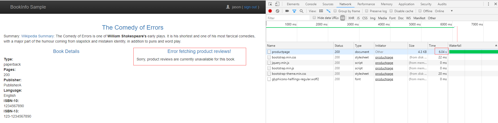
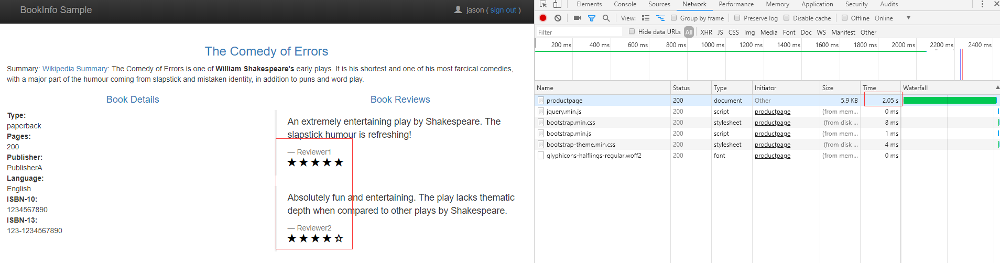
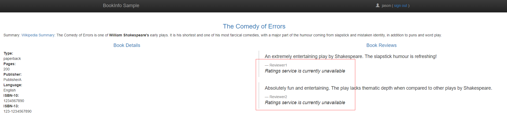

## 故障注入

本文演示 Istio 故障注入的基本方式。

1. 部署 Bookinfo 样例程序（部署方法详见[路由控制](1-routing.md)），设置如下路由策略

    ```sh
    $ kubectl apply -f samples/bookinfo/networking/destination-rule-all.yaml
    $ kubectl apply -f samples/bookinfo/networking/virtual-service-all-v1.yaml
    $ kubectl apply -f samples/bookinfo/networking/virtual-service-reviews-test-v2.yaml
    ```

    配置内容分别为：

    ```yaml
    apiVersion: networking.istio.io/v1alpha3
    kind: DestinationRule
    metadata:
      name: productpage
    spec:
      host: productpage
      subsets:
      - name: v1
        labels:
          version: v1
    ---
    apiVersion: networking.istio.io/v1alpha3
    kind: DestinationRule
    metadata:
      name: reviews
    spec:
      host: reviews
      subsets:
      - name: v1
        labels:
          version: v1
      - name: v2
        labels:
          version: v2
      - name: v3
        labels:
          version: v3
    ---
    apiVersion: networking.istio.io/v1alpha3
    kind: DestinationRule
    metadata:
      name: ratings
    spec:
      host: ratings
      subsets:
      - name: v1
        labels:
          version: v1
      - name: v2
        labels:
          version: v2
      - name: v2-mysql
        labels:
          version: v2-mysql
      - name: v2-mysql-vm
        labels:
          version: v2-mysql-vm
    ---
    apiVersion: networking.istio.io/v1alpha3
    kind: DestinationRule
    metadata:
      name: details
    spec:
      host: details
      subsets:
      - name: v1
        labels:
          version: v1
      - name: v2
        labels:
          version: v2
    ---
    ```

    ```yaml
    apiVersion: networking.istio.io/v1alpha3
    kind: VirtualService
    metadata:
      name: productpage
    spec:
      hosts:
      - productpage
      http:
      - route:
        - destination:
            host: productpage
            subset: v1
    ---
    apiVersion: networking.istio.io/v1alpha3
    kind: VirtualService
    metadata:
      name: reviews
    spec:
      hosts:
      - reviews
      http:
      - route:
        - destination:
            host: reviews
            subset: v1
    ---
    apiVersion: networking.istio.io/v1alpha3
    kind: VirtualService
    metadata:
      name: ratings
    spec:
      hosts:
      - ratings
      http:
      - route:
        - destination:
            host: ratings
            subset: v1
    ---
    apiVersion: networking.istio.io/v1alpha3
    kind: VirtualService
    metadata:
      name: details
    spec:
      hosts:
      - details
      http:
      - route:
        - destination:
            host: details
            subset: v1
    ---
    ```

    ```yaml
    apiVersion: networking.istio.io/v1alpha3
    kind: VirtualService
    metadata:
      name: reviews
    spec:
      hosts:
        - reviews
      http:
      - match:
        - headers:
            end-user:
              exact: jason
        route:
        - destination:
            host: reviews
            subset: v2
      - route:
        - destination:
            host: reviews
            subset: v1
    ```

    经过上述配置，路由策略变成如下路径：

    - productpage → reviews:v2 → ratings （jason 用户）
    - productpage → reviews:v1 （非 jason 用户）

2. 注入 HTTP 延迟故障
   
   `samples/bookinfo/networking/virtual-service-ratings-test-delay.yaml`

    ```yaml
    apiVersion: networking.istio.io/v1alpha3
    kind: VirtualService
    metadata:
      name: ratings
    spec:
      hosts:
      - ratings
      http:
      - match:
        - headers:
            end-user:
              exact: jason
        fault:
          delay:
            percentage:
              value: 100.0
            fixedDelay: 7s
        route:
        - destination:
            host: ratings
            subset: v1
      - route:
        - destination:
            host: ratings
            subset: v1
    ```

    以上配置会使 jason 用户的访问变慢 7s

    ```sh
    $ kubectl apply -f samples/bookinfo/networking/virtual-service-ratings-test-delay.yaml
    ```

    ```sh
    $ kubectl port-forward --address 0.0.0.0 $(kubectl get pod -l app=productpage -o jsonpath='{.items[0].metadata.name}') 9080:9080
    ```

    浏览器访问：http://\<IP>:9080/productpage，其中 \<IP> 为执行上述命令的主机 IP，以 jason 用户登录

    

    我们发现加载 6s 左右的时间，出现超时错误！这是因为程序自身设定的超时时间小于我们注入的延迟故障时间，我们尝试调小这个 delay 延时。修改 `samples/bookinfo/networking/virtual-service-ratings-test-delay.yaml` 的 `fixedDelay` 为 2s，重新应用配置，再次通过浏览器检查。

    

    可以看到，这次页面加载正常了，而且确实延迟了大约 2s。

    这个实验说明，故障注入导致的延迟与应用程序自身的超时时间均会对程序造成影响！

3. 注入 HTTP Abort 故障

    `samples/bookinfo/networking/virtual-service-ratings-test-abort.yaml`

    ```yaml
    apiVersion: networking.istio.io/v1alpha3
    kind: VirtualService
    metadata:
      name: ratings
    spec:
      hosts:
      - ratings
      http:
      - match:
        - headers:
            end-user:
              exact: jason
        fault:
          abort:
            percentage:
              value: 100.0
            httpStatus: 500
        route:
        - destination:
            host: ratings
            subset: v1
      - route:
        - destination:
            host: ratings
            subset: v1
    ```

    应用该配置，然后浏览器以 jason 登录访问 `/productpage` 页面

    ```sh
    $ kubectl apply -f samples/bookinfo/networking/virtual-service-ratings-test-abort.yaml
    ```

    

    发现直接出现错误，符合预期。

4. 清理

   ```sh
   $ kubectl delete -f samples/bookinfo/networking/virtual-service-all-v1.yaml
   ```

##### 原理分析

`reviews-v2` 在访问 `ratings` 服务时，传递了 `end-user` 等 header，这需要程序自己处理！这些 HTTP headers Istio 会使用，但需要应用程序负责传递。

```java
Invocation.Builder builder = ratingsTarget.reque(MediaType.APPLICATION_JSON);
if(xreq!=null) {
  builder.header("x-request-id",xreq);
}
if(xtraceid!=null) {
  builder.header("x-b3-traceid",xtraceid);
}
if(xspanid!=null) {
  builder.header("x-b3-spanid",xspanid);
}
if(xparentspanid!=null) {
  builder.header("x-b3-parentspanid",xparentspanid);
}
if(xsampled!=null) {
  builder.header("x-b3-sampled",xsampled);
}
if(xflags!=null) {
  builder.header("x-b3-flags",xflags);
}
if(xotspan!=null) {
  builder.header("x-ot-span-context",xotspan);
}
if(user!=null) {
  builder.header("end-user", user);
}
if(useragent!=null) {
  builder.header("user-agent", useragent);
}
Response r = builder.get();
```

源代码：https://github.com/istio/istio/blob/master/samples/bookinfo/src/reviews/reviews-application/src/main/java/application/rest/LibertyRestEndpoint.java#L117
