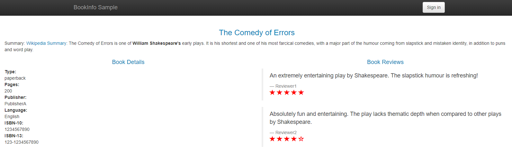

## 流量转移

本文演示使用 Istio 控制流量的按比例分发，适用于灰度发布场景。

1. 部署 Bookinfo 样例程序（部署方法详见[路由控制](1-routing.md)），设置默认路由策略

    首先，定义不同版本服务的 `Destination rule`

    ```yaml
    apiVersion: networking.istio.io/v1alpha3
    kind: DestinationRule
    metadata:
      name: productpage
    spec:
      host: productpage
      subsets:
      - name: v1
        labels:
          version: v1
    ---
    apiVersion: networking.istio.io/v1alpha3
    kind: DestinationRule
    metadata:
      name: reviews
    spec:
      host: reviews
      subsets:
      - name: v1
        labels:
          version: v1
      - name: v2
        labels:
          version: v2
      - name: v3
        labels:
          version: v3
    ---
    apiVersion: networking.istio.io/v1alpha3
    kind: DestinationRule
    metadata:
      name: ratings
    spec:
      host: ratings
      subsets:
      - name: v1
        labels:
          version: v1
      - name: v2
        labels:
          version: v2
      - name: v2-mysql
        labels:
          version: v2-mysql
      - name: v2-mysql-vm
        labels:
          version: v2-mysql-vm
    ---
    apiVersion: networking.istio.io/v1alpha3
    kind: DestinationRule
    metadata:
      name: details
    spec:
      host: details
      subsets:
      - name: v1
        labels:
          version: v1
      - name: v2
        labels:
          version: v2
    ---
    ```

    ```sh
    $ kubectl apply -f samples/bookinfo/networking/destination-rule-all.yaml
    ```

    然后，设置默认使用 `v1` 版服务

    ```yaml
    apiVersion: networking.istio.io/v1alpha3
    kind: VirtualService
    metadata:
      name: productpage
    spec:
      hosts:
      - productpage
      http:
      - route:
        - destination:
            host: productpage
            subset: v1
    ---
    apiVersion: networking.istio.io/v1alpha3
    kind: VirtualService
    metadata:
      name: reviews
    spec:
      hosts:
      - reviews
      http:
      - route:
        - destination:
            host: reviews
            subset: v1
    ---
    apiVersion: networking.istio.io/v1alpha3
    kind: VirtualService
    metadata:
      name: ratings
    spec:
      hosts:
      - ratings
      http:
      - route:
        - destination:
            host: ratings
            subset: v1
    ---
    apiVersion: networking.istio.io/v1alpha3
    kind: VirtualService
    metadata:
      name: details
    spec:
      hosts:
      - details
      http:
      - route:
        - destination:
            host: details
            subset: v1
    ---
    ```

    ```sh
    $ kubectl apply -f samples/bookinfo/networking/virtual-service-all-v1.yaml
    ```

    ```sh
    $ kubectl port-forward --address 0.0.0.0 $(kubectl get pod -l app=productpage -o jsonpath='{.items[0].metadata.name}') 9080:9080
    ```

    浏览器访问：http://\<IP>:9080/productpage，其中 \<IP> 为执行上述命令的主机 IP
    
    当然，页面总是没有星星，因为使用的 `reviews:v1` 服务

2. 下面重点来了，调整路由，50% 请求使用 `reviews:v3` 服务

    ```yaml
    apiVersion: networking.istio.io/v1alpha3
    kind: VirtualService
    metadata:
      name: reviews
    spec:
      hosts:
        - reviews
      http:
      - route:
        - destination:
            host: reviews
            subset: v1
          weight: 50
        - destination:
            host: reviews
            subset: v3
          weight: 50
    ```

    ```sh
    $ kubectl apply -f samples/bookinfo/networking/virtual-service-reviews-50-v3.yaml
    virtualservice.networking.istio.io/reviews configured
    ```

    重新刷新页面，会发现有时出现红色星星，有时没有星星，概率各占 50%

    进一步，完全使用 `reviews:v3` 服务

    ```yaml
    apiVersion: networking.istio.io/v1alpha3
    kind: VirtualService
    metadata:
      name: reviews
    spec:
      hosts:
        - reviews
      http:
      - route:
        - destination:
            host: reviews
            subset: v3
    ```

    ```sh
    $ kubectl apply -f samples/bookinfo/networking/virtual-service-reviews-v3.yaml
    virtualservice.networking.istio.io/reviews configured
    ```

    再次刷新页面，就只能看到红色星星了

    

3. 清理

    ```sh
    $ kubectl delete -f samples/bookinfo/networking/virtual-service-all-v1.yaml
    virtualservice.networking.istio.io "productpage" deleted
    virtualservice.networking.istio.io "reviews" deleted
    virtualservice.networking.istio.io "ratings" deleted
    virtualservice.networking.istio.io "details" deleted
    ```
