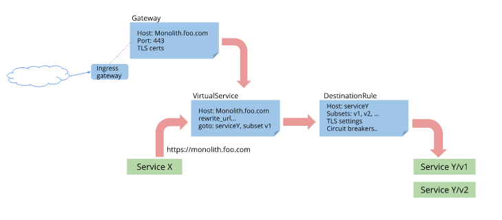

## TCP 流量转移

[上节](3-traffic-shifting.md)我们讨论了 HTTP 请求的按权重分配，本节实验 TCP 流量的权重分配。

1. 部署 TCP 样例应用

    首先确保，`default` 命名空间开启了自动注入

    ```sh
    $ kubectl get namespace -L istio-injection
    NAME              STATUS   AGE   ISTIO-INJECTION
    default           Active   11d   enabled
    istio-system      Active   11d   
    kube-node-lease   Active   11d   
    kube-public       Active   11d   
    kube-system       Active   11d 
    ```

    部署 TCP 应用

    ```yaml
    apiVersion: v1
    kind: Service
    metadata:
      name: tcp-echo
      labels:
        app: tcp-echo
    spec:
      ports:
      - name: tcp
        port: 9000
      selector:
        app: tcp-echo
    ---
    apiVersion: extensions/v1beta1
    kind: Deployment
    metadata:
      name: tcp-echo-v1
    spec:
      replicas: 1
      template:
        metadata:
          labels:
            app: tcp-echo
            version: v1
        spec:
          containers:
          - name: tcp-echo
            image: istio/tcp-echo-server:1.1
            imagePullPolicy: IfNotPresent
            args: [ "9000", "one" ]
            ports:
            - containerPort: 9000
    ---
    apiVersion: extensions/v1beta1
    kind: Deployment
    metadata:
      name: tcp-echo-v2
    spec:
      replicas: 1
      template:
        metadata:
          labels:
            app: tcp-echo
            version: v2
        spec:
          containers:
          - name: tcp-echo
            image: istio/tcp-echo-server:1.1
            imagePullPolicy: IfNotPresent
            args: [ "9000", "two" ]
            ports:
            - containerPort: 9000
    ```

    ```sh
    $ kubectl apply -f samples/tcp-echo/tcp-echo-services.yaml
    service/tcp-echo created
    deployment.extensions/tcp-echo-v1 created
    deployment.extensions/tcp-echo-v2 created
    ```

    确认是否注入成功，`2/2` 代表注入了

    ```sh
    $ kubectl get pod -l app=tcp-echo
    NAME                           READY   STATUS    RESTARTS   AGE
    tcp-echo-v1-6fd59b9d57-bmdfn   2/2     Running   0          68s
    tcp-echo-v2-6d87cfc58d-whs42   2/2     Running   0          67s
    ```

2. 配置仅路由到 `v1` 版本

    ```yaml
    apiVersion: networking.istio.io/v1alpha3
    kind: Gateway
    metadata:
      name: tcp-echo-gateway
    spec:
      selector:
        istio: ingressgateway
      servers:
      - port:
          number: 31400
          name: tcp
          protocol: TCP
        hosts:
        - "*"
    ---
    apiVersion: networking.istio.io/v1alpha3
    kind: DestinationRule
    metadata:
      name: tcp-echo-destination
    spec:
      host: tcp-echo
      subsets:
      - name: v1
        labels:
          version: v1
      - name: v2
        labels:
          version: v2
    ---
    apiVersion: networking.istio.io/v1alpha3
    kind: VirtualService
    metadata:
      name: tcp-echo
    spec:
      hosts:
      - "*"
      gateways:
      - tcp-echo-gateway
      tcp:
      - match:
        - port: 31400
        route:
        - destination:
            host: tcp-echo
            port:
              number: 9000
            subset: v1
    ```

    ```sh
    $ kubectl apply -f samples/tcp-echo/tcp-echo-all-v1.yaml
    gateway.networking.istio.io/tcp-echo-gateway created
    destinationrule.networking.istio.io/tcp-echo-destination created
    virtualservice.networking.istio.io/tcp-echo created
    ```

3. 由于我的 Istio 环境没有配置 LB，因此需要通过 NodePort 方式访问 Gateway 网关

    首先查看下 ingress-gateway 信息

    ```sh
    $ kubectl get svc istio-ingressgateway -n istio-system
    NAME                   TYPE           CLUSTER-IP     EXTERNAL-IP   PORT(S)                                                                                                                                      AGE
    istio-ingressgateway   LoadBalancer   10.96.77.217   <pending>     15020:31939/TCP,80:31380/TCP,443:31390/TCP,31400:31400/TCP,15029:31405/TCP,15030:30711/TCP,15031:32652/TCP,15032:31559/TCP,15443:32151/TCP   11d
    ```

    可以看到 31400 端口映射到宿主机仍然是 31400，我们通过访问宿主机的 31400 端口实现对 gateway 的访问

    ```sh
    $ for i in {1..10}; do docker run -it --rm busybox sh -c "(date; sleep 1) | nc 192.168.137.58 31400"; done
    one Mon Jun 10 04:03:47 UTC 2019
    one Mon Jun 10 04:03:49 UTC 2019
    one Mon Jun 10 04:03:51 UTC 2019
    one Mon Jun 10 04:03:53 UTC 2019
    one Mon Jun 10 04:03:54 UTC 2019
    one Mon Jun 10 04:03:56 UTC 2019
    one Mon Jun 10 04:03:57 UTC 2019
    one Mon Jun 10 04:03:59 UTC 2019
    one Mon Jun 10 04:04:01 UTC 2019
    one Mon Jun 10 04:04:03 UTC 2019
    ```

    可以看出，调用的都是 `v1` 版本的回显服务

4. 切换 20% 流量到 `v2` 版本

    ```yaml
    apiVersion: networking.istio.io/v1alpha3
    kind: VirtualService
    metadata:
      name: tcp-echo
    spec:
      hosts:
      - "*"
      gateways:
      - tcp-echo-gateway
      tcp:
      - match:
        - port: 31400
        route:
        - destination:
            host: tcp-echo
            port:
              number: 9000
            subset: v1
          weight: 80
        - destination:
            host: tcp-echo
            port:
              number: 9000
            subset: v2
          weight: 20
    ```

    ```sh
    $ kubectl apply -f samples/tcp-echo/tcp-echo-20-v2.yaml
    virtualservice.networking.istio.io/tcp-echo configured
    ```

    验证流量分发配置是否生效

    ```sh
    $ for i in {1..10}; do docker run -it --rm busybox sh -c "(date; sleep 1) | nc 192.168.137.58 31400"; done
    one Mon Jun 10 04:09:26 UTC 2019
    one Mon Jun 10 04:09:27 UTC 2019
    one Mon Jun 10 04:09:29 UTC 2019
    two Mon Jun 10 04:09:31 UTC 2019
    one Mon Jun 10 04:09:32 UTC 2019
    one Mon Jun 10 04:09:34 UTC 2019
    one Mon Jun 10 04:09:36 UTC 2019
    one Mon Jun 10 04:09:37 UTC 2019
    one Mon Jun 10 04:09:39 UTC 2019
    one Mon Jun 10 04:09:41 UTC 2019
    ```

    可以看出，已经出现了 `v2` 版本服务，尽管概率不太匹配（这是因为采样次数太少的原因）

5. 清理

    ```sh
    $ kubectl delete -f samples/tcp-echo/tcp-echo-all-v1.yaml
    $ kubectl delete -f samples/tcp-echo/tcp-echo-services.yaml
    ```

##### 原理分析

1. Istio 通过 Gateway 定义外部访问入口，VirtualService 通过绑定 Gateway 对外提供服务，访问逻辑如下图：

   

2. 对于普通的 HTTP 服务，可以共享 80/443 端口，通过 host 区分不同服务；
   对于 TCP 服务，则需要提供专用端口；
