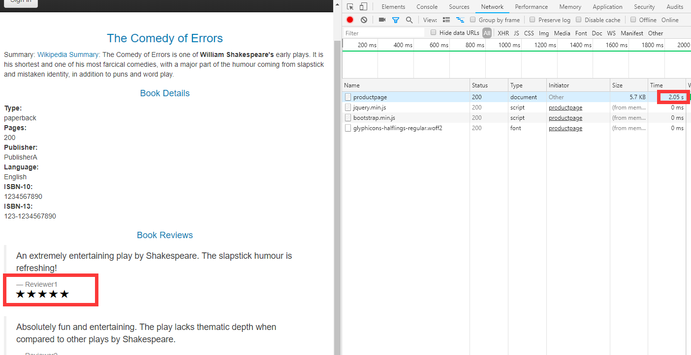
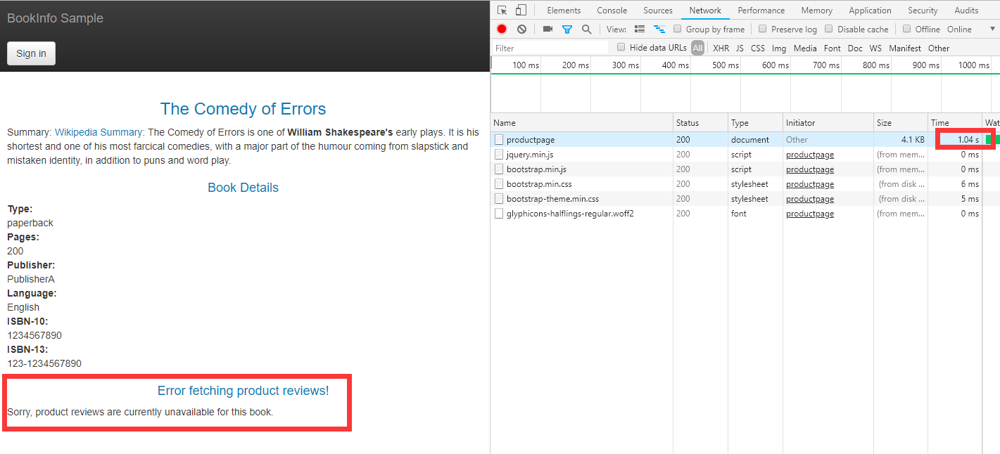

## 配置服务超时时间

本文介绍如何通过 Istio 控制服务的超时时间。
超时时间存在的意义即能够快速失败返回，避免故障服务拖垮系统。

1. 部署 Bookinfo 样例程序（部署方法详见[路由控制](1-routing.md)）

    记得设置默认路由策略

    ```sh
    $ kubectl apply -f samples/bookinfo/networking/destination-rule-all.yaml
    $ kubectl apply -f samples/bookinfo/networking/virtual-service-all-v1.yaml
    ```

2. 配置 `reviews` 服务使用 `v2` 版本

    ```sh
    $ kubectl apply -f - <<EOF
    apiVersion: networking.istio.io/v1alpha3
    kind: VirtualService
    metadata:
      name: reviews
    spec:
      hosts:
        - reviews
      http:
      - route:
        - destination:
            host: reviews
            subset: v2
    EOF
    virtualservice.networking.istio.io/reviews configured
    ```

3. 给 `ratings` 设置两秒的延迟

    ```sh
    $ kubectl apply -f - <<EOF
    apiVersion: networking.istio.io/v1alpha3
    kind: VirtualService
    metadata:
      name: ratings
    spec:
      hosts:
      - ratings
      http:
      - fault:
          delay:
            percent: 100
            fixedDelay: 2s
        route:
        - destination:
            host: ratings
            subset: v1
    EOF
    virtualservice.networking.istio.io/ratings configured
    ```

    这样一来，`product` -> `reviews` -> `retings` 至少就得延迟两秒了

    ```sh
    $ kubectl port-forward --address 0.0.0.0 $(kubectl get pod -l app=productpage -o jsonpath='{.items[0].metadata.name}') 9080:9080
    ```

    浏览器访问：http://\<IP>:9080/productpage，其中 \<IP> 为执行上述命令的主机 IP

    

    可以看到，请求返回消耗 `2s` 多

4. 接下来，配置 `review` 服务的超时时间为 `0.5s`

    ```sh
    $ kubectl apply -f - <<EOF
    apiVersion: networking.istio.io/v1alpha3
    kind: VirtualService
    metadata:
      name: reviews
    spec:
      hosts:
      - reviews
      http:
      - route:
        - destination:
            host: reviews
            subset: v2
        timeout: 0.5s
    EOF
    virtualservice.networking.istio.io/reviews configured
    ```

    重新刷新网页

    

    可以发现，`1s` 就返回了，而且 `reviews` 服务不可用

    为什么是 `1s` 而不是 `0.5s` 呢，因为 `product` 在失败后会再试一次，所以 `0.5 + 0.5 = 1`

    `reviews` 被设置为 `0.5s` 就超时，而 `ratings` 需要 `2s` 才能返回，因此 `reviews` 永远不会成功，`product` 的访问继而也不会成功

5. 清理

   ```sh
   $ kubectl delete -f samples/bookinfo/networking/virtual-service-all-v1.yaml
   ```

##### 附：`product` [重试代码](https://github.com/istio/istio/blob/master/samples/bookinfo/src/productpage/productpage.py#L336)

```python
def getProductReviews(product_id, headers):
    ## Do not remove. Bug introduced explicitly for illustration in fault injection task
    ## TODO: Figure out how to achieve the same effect using Envoy retries/timeouts
    ## 这里重试两次
    for _ in range(2):
        try:
            url = reviews['name'] + "/" + reviews['endpoint'] + "/" + str(product_id)
            res = requests.get(url, headers=headers, timeout=3.0)
        except:
            res = None
        if res and res.status_code == 200:
            return 200, res.json()
    status = res.status_code if res is not None and res.status_code else 500
    return status, {'error': 'Sorry, product reviews are currently unavailable for this book.'}
```
